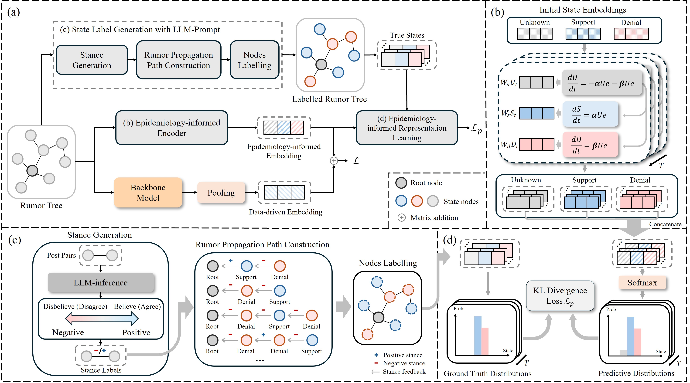

<<<<<<< HEAD
# EIN

This repository is the implementation of The Web Conference 2025 (WWW'25) paper: Epidemiology-informed Network for Robust Rumor Detection

run main.py to train and test the model.

## Requirements:
- python==3.12
- pytorch==2.3.1
- torch_geometric==2.5.3
- tqdm==4.66.4
- sklearn==1.5.0
- scipy==1.14.0
- numpy==1.26.4
- pandas==2.2.2
- jieba==0.42.1
- nltk==3.8.1
- gensim==4.3.2
- transformers==4.42.3
- yaml==0.2.5
=======

## 在DRWeibo增加資料夾high_confidence_files，建立processed和raw資料夾
'''
DRWeibo
│
├── high_confidence_files
│   ├── processed
│   │   ├── data.pt
│   │   ├── pre_filter.pt
│   │   └── pre_transform.pt
│   └── raw
│       └── [篩選過後的檔案]
'''